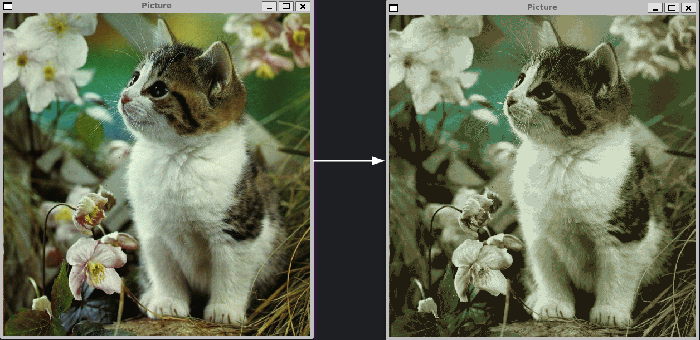

# Image converter
> Convert 256 bit bmp image to 16 bit pcx image.
## Introduction
This application was written as part of a university course "Transform image data".
## Dependencies

<ul>
<li>g++</li>
<li>make</li>
<li>cmake</li>
<li>sfml (for preview)</li>
</ul>

## Usage
Clone repository:

```sh
git clone https://github.com/ElaSparks/ImageConverter
```

Build project:

```sh
cmake -Bbuild . && cd build && make
```

Run the program:

```sh
./build/bin/converter path/to/image
```

## Preview
